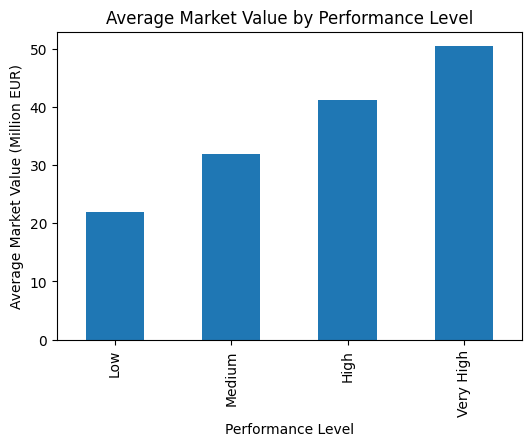
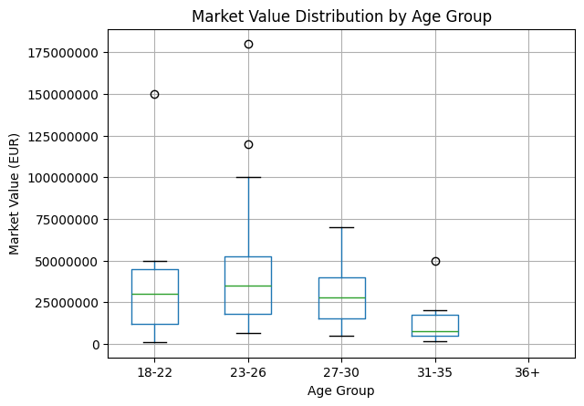

# Player Market Value Analysis

This project explores the relationship between attacking position players' on-field performance, age, and market value in the Premier League. It was developed as the final project for the Data Analyst Essentials Nanodegree program provided by Udacity, demonstrating skills in data gathering, cleaning, integration, and exploratory data analysis.

---

## Problem Statement

The goal of this project is to investigate how soccer forwards’ performance metrics and age relate to their market value in the Premier League. Specifically, the analysis examines whether factors such as goals, assists (combined as points), and player age are associated with higher market valuations. The project aims to uncover patterns linking athletic output and career stage to financial worth.

---

## Data Gathering

Two different data-gathering methods were used:

- Downloading datasets directly from Kaggle  
- Programmatic downloading from Kaggle  

The dataset URLs can be found in:  
[Dataset links](Dataset%20links.txt)

---

## Files in This Repository

- **analysis.ipynb** – Main Jupyter Notebook containing data cleaning, merging, visualization, and analysis  
- **transfer_raw.csv** – Raw Transfermarkt performance dataset  
- **premier_raw.csv** – Raw Premier League market value dataset  
- **cleaned_combined_players.csv** – Final cleaned and merged dataset used for analysis  

---

## Key Project Steps

- Assessing data quality and tidiness issues  
- Cleaning and standardizing datasets  
- Removing unnecessary variables and handling missing values  
- Merging performance and financial data  
- Creating visualizations to explore relationships  
- Interpreting results in relation to the research question  

---

## Tools & Technologies

- Python  
- pandas  
- NumPy  
- Matplotlib  
- Jupyter Notebook  

---

## Key Findings (Summary)

- Higher attacking performance is associated with higher market value.  
- Younger players, particularly those in their early to mid-20s, tend to have higher valuations.  
- Market value generally declines as players age beyond their peak performance years.  

---

## Visualizations

### Market Value by Performance Level

### Market Value Distribution by Age Group

  
